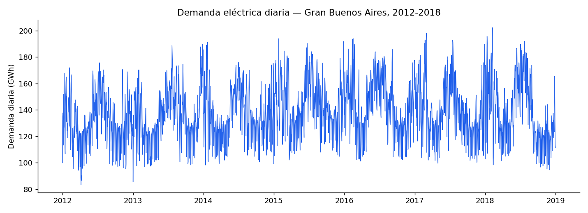
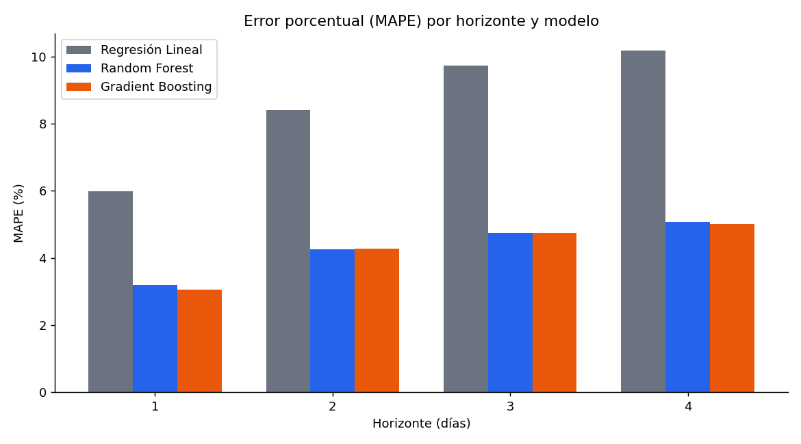
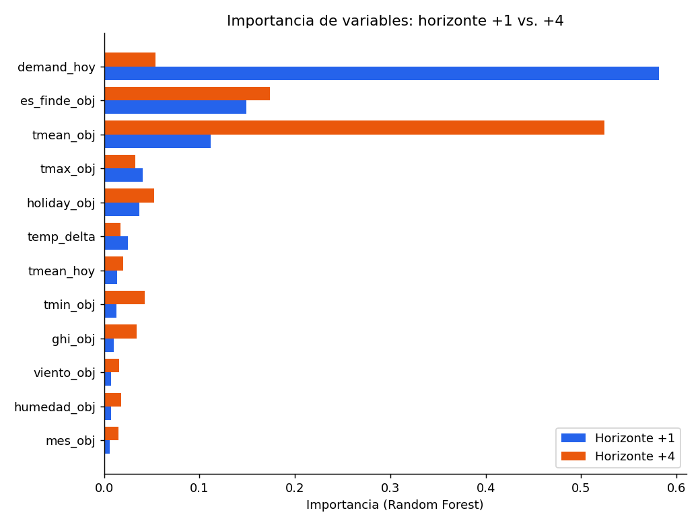
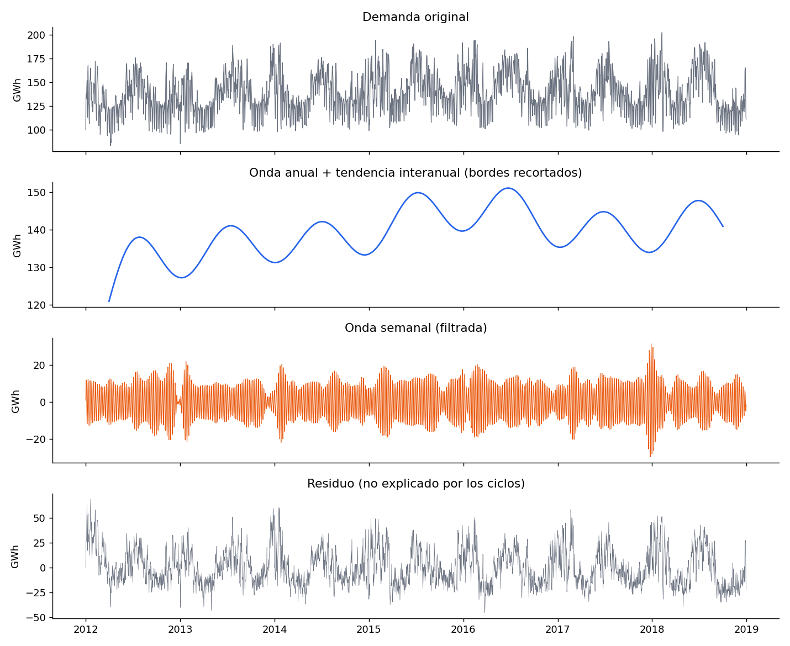

# Pronóstico de demanda eléctrica — Gran Buenos Aires

Predicción de la demanda eléctrica del Gran Buenos Aires (GBA) a 1, 2, 3 y 4 días de anticipación, usando Random Forest y Gradient Boosting, y una descomposición espectral de la señal (ciclo anual, tendencia interanual, ciclo semanal) con técnicas de análisis de series de tiempo.

**[→ Ver el notebook completo](notebook/energy_forecast_gba.ipynb)**



## Resultados

| Horizonte | Mejor modelo | MAPE |
|---|---|---|
| +1 día | Gradient Boosting | 3.06% |
| +2 días | Random Forest | 4.25% |
| +3 días | Random Forest / Gradient Boosting | 4.75% |
| +4 días | Gradient Boosting | 5.02% |



El hallazgo más interesante no es el error en sí, sino **qué variable pesa más según el horizonte**: a 1 día, la demanda de hoy explica el 58% de la predicción (persistencia). A 4 días, esa variable cae al 5% y la temperatura del día objetivo pasa a explicar el 52%. El modelo aprendió solo a dejar de confiar en "hoy" a medida que el horizonte crece — sin que se lo indicáramos explícitamente.

**Conectando con la descomposición de la sección 3:** el calendario solo (sin clima) dejaba la mayor parte de la variabilidad sin explicar. Sumando clima, el modelo baja el error a 3-5% — una mejora real, pero no perfecta: ese error restante es la porción de la demanda que ni el calendario ni el clima explican del todo (ruido, eventos puntuales, variables que no están en este dataset).



## Datos

- **Demanda y clima:** Maisonnave, Delbianco, Tohme, Maguitman & Milios (2023). *Electricity Energy Consumption in the Gran Buenos Aires from 2012 to 2018 — CAMMESA data*. Mendeley Data. [DOI: 10.17632/92g8n7pjp2.1](https://data.mendeley.com/datasets/92g8n7pjp2/1)
- **Cobertura:** Gran Buenos Aires (GBA), no la demanda nacional argentina completa. Datos horarios, 2012-2018 (última versión pública de este dataset).

## Qué hay en el notebook

1. **Carga y agregación** de datos horarios a diarios
2. **Análisis exploratorio**: serie completa, perfil horario (la demanda tiene meseta al mediodía y pico fuerte a las 21hs, no un único pico), demanda día hábil vs. fin de semana
3. **Descomposición espectral**: cuánto de la variabilidad de la demanda se explica por ciclos de calendario (anual, tendencia interanual, semanal) vs. cuánto queda sin explicar. Cada escala se trata con la técnica adecuada a su forma real: ajuste de coseno para el ciclo anual (tiene causa física sinusoidal clara), filtros Butterworth para tendencia y ciclo semanal (formas sin una onda limpia). Esta sección es exploratoria y no alimenta al modelo de forecasting — usar sus componentes como features introduciría fuga de información del futuro, porque se calculan mirando toda la serie a la vez.

   

   **Por qué esto importa para el modelo:** esta descomposición usa *solo* información de calendario (fecha) para explicar la demanda, y aun así el residuo (lo no explicado) es la porción más grande de la variabilidad total. Eso es la evidencia de que el calendario solo no alcanza — es la justificación concreta de por qué el modelo de forecasting de la siguiente sección necesita, además del calendario, variables de clima. Dicho de otro modo: la sección 3 responde "¿cuánto explica el calendario solo?" y la sección 5 responde "¿cuánto mejora si le sumamos clima?".

4. **Feature engineering**: variables por horizonte sin data leakage (verificado a mano con un ejemplo concreto), split temporal 2012-2016 entrenamiento / 2017-2018 test
5. **Entrenamiento y comparación** de 3 modelos (Regresión Lineal, Random Forest, Gradient Boosting) × 4 horizontes
6. **Importancia de variables** por horizonte
7. **Conclusiones y limitaciones**

## Limitaciones documentadas

- Se usa el clima real del día objetivo como si fuera el pronóstico meteorológico ("información perfecta") — un sistema real tendría error adicional del pronóstico en sí. Por eso se limitó el horizonte a 4 días: más allá de eso, la confiabilidad de los pronósticos meteorológicos reales cae bastante.
- Se excluyó la actividad económica (EMAE) por su retraso real de publicación y su baja variabilidad diaria — queda como extensión futura.
- El dataset cubre GBA, no toda Argentina.
- Los datos llegan hasta diciembre 2018.

## Cómo correrlo

```
pip install pandas numpy scipy scikit-learn matplotlib
jupyter notebook notebooks/energy_forecast_gba.ipynb
```
